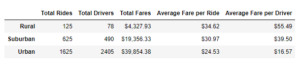

# PyBer_Analysis
## Overview of the analysis  
The purpose of this analysis is to compare ride share data that is broken down and grouped into three different environments: urban, suburban, and rural settings.  During the later part of this analysis the ride share data is grouped into weekly summaries to identify changes in weekly trends and total fares collected from PyBer in different environments over time.
### Results
The overwhelming majority of fares collected by PyBer where from the shear volume of rides within the urban environment.  Ride share services are more popular in cities for multiple reasons, but plain population density is likely to account for most of the disparity in fares, volume of rides and drivers respectively.  Urban environments account for nearly 62.7% of the total fares collected by PyBer as well as 68.4% of the rides serviced with PyBer, however, urban environments account for 80.9% of the drivers partnered with PyBer.
Suburban environments accounted for 30.5% of the total fares collected while representing 26.3% of the total rides and only 16.5% of PyBer’s partnered drivers.  While suburban environments account for less of the overall fares collected for PyBer the ratio between fares and drivers (or fares and volume of rides) is higher than that of urban environments.
Rural environments accounted for the smallest of the total fares only obtaining 6.8% of the total fares obtained in this data set and similarly only 5.3% of the total rides. However, this segment of fares was serviced by only 2.6% of our total partnered drivers.  Thus, the ratio of fares per driver is doubled when comparing urban to suburban drivers and even grater when compared to data collected from rural settings.

Data Summary:

Fares by environment:

Rides by environment:

Drivers by environment:

The second part of this analysis went further to compare fares collected in the three different settings grouped into summarized data points to see how the total number of fares changed (weekly) over the course of a few months.  This data reveals a spike in ride share demand just before March in late February across all three of the environments and then fluctuates in a mildly general downward trend towards the end of April.  Learning what is responsible for the heightened demand just before march could provide insight for future analysis.

## Summary
After sifting through the data three recommendations for the future is as follows:
1. While urban locations account for over half of the fares collected the average fare per ride is higher for Suburban and Rural environments so recruiting more drivers for those localities might improve accessibility to Pyber in those locations increasing demand.
2. Demand for ride sharing services seems higher as weather warms so focusing on advertising and promotions just before spring could encourage natural growth in ride share demand 
3. Further collection of data in the future over a longer period would provide more accurate insights into future performance.  Collecting data on the total population sizes from each of the cities and towns within the data set would provide more accurate insight into the potential for increased demand in PyBer ride sharing services.
